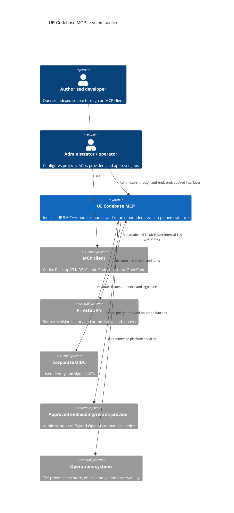
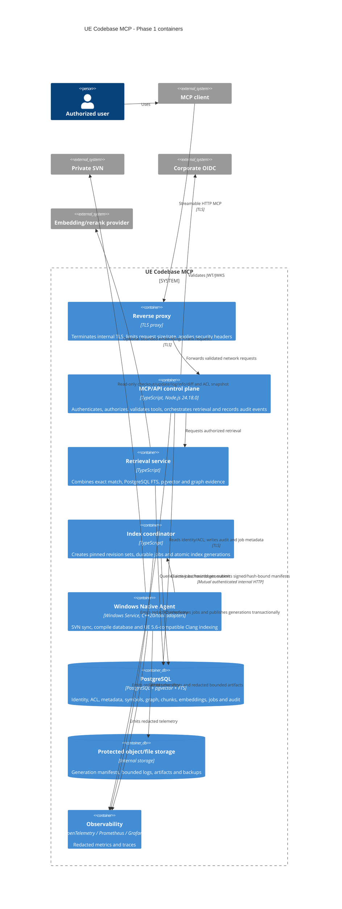
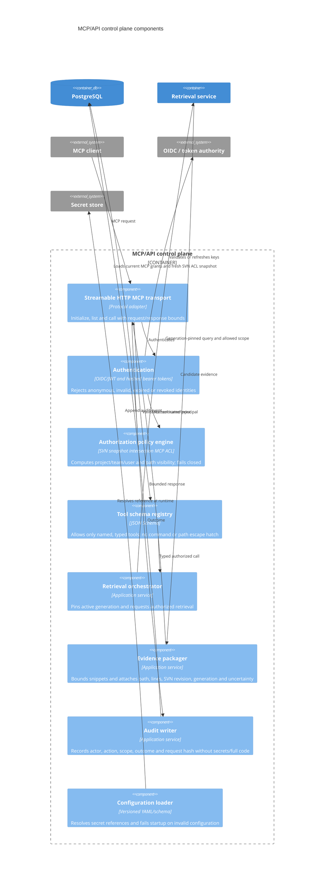

# Phase 1 architecture (C4)

Status: implementation baseline complete; architecture and security review sign-off pending.

This document describes only Phase 1. It does not authorize Phase 2 work or relax any G1 gate. The system indexes an Unreal Engine 5.6 private Engine Fork and game C++/module sources from SVN, then exposes evidence-backed retrieval over Streamable HTTP MCP.

## Context



The MCP product never exposes code or arbitrary file writes, patch application, commit, push, submit, or a general-purpose shell. Phase 1 public tools are retrieval/status operations only. Later approved job tools may select an administrator-defined reindex, UBT or UAT preset; they still cannot accept command strings or mutate version-controlled source.

## Containers



No client can connect directly to PostgreSQL, object storage, an Agent internal endpoint, an SVN workspace, or observability administration. Agent endpoints bind only to the management network or localhost and use short-lived Agent credentials distinct from user MCP tokens.

## Control-plane components



Authorization is applied before candidate retrieval and again while packaging evidence. The effective permission relation is:

```text
effective_access(principal, repository, path, revision)
  = current_mcp_acl(principal, project, repository, path)
  intersection fresh_svn_acl_snapshot(principal, repository, path, revision)
```

Missing, stale, invalid or indeterminate identity/ACL inputs produce no access. Search counts, timing details, symbol existence and path normalization errors must not become an authorization side channel.

## Index generation and query invariants

1. A generation is bound to an immutable revision set before work begins; an SVN HEAD change cannot move it.
2. Agent workspaces are read-only from the product perspective and isolated by project, repository, revision and job.
3. Index output first enters a non-queryable staging generation. Manifest hashes, revision mapping, ACL provenance and completeness checks must pass before one database transaction changes the active generation.
4. Queries see exactly one active generation. Failed publication retains the previous active generation.
5. Every source result includes project/repository identifiers, `repository_kind=svn`, branch, revision, generation, relative normalized path, line range, bounded snippet when authorized, score/match reasons, uncertainty and indexed time.
6. Provider failures may degrade semantic ranking to exact/FTS retrieval; they cannot bypass authorization or evidence requirements.
7. Correlation IDs join request, job, Agent and audit records without placing tokens, secrets or complete source payloads in telemetry.

## Phase and scale constraints

- Phase 1 VCS is SVN only. Git and Perforce require the post-G3 extension phase.
- UE tool integration targets UE 5.6 and the private Fork's real compile database; guessed global flags are forbidden.
- The initial data plane is PostgreSQL plus pgvector and FTS. A specialized search/vector service requires Phase 3 benchmark evidence and a separate ADR.
- The expected operating point is about 30 users and 10 concurrent queries, with query P95 at most 5 seconds and P99 at most 10 seconds.
- Code freshness is at most 5 minutes; initial Engine Fork plus first project indexing is at most 24 hours.

## Review evidence required

Architecture and security reviewers must verify the diagrams against deployed network policy, configuration schema, database roles, Agent service identity, ACL negative tests and the enumerated MCP schemas. This document does not claim those human reviews have occurred.
