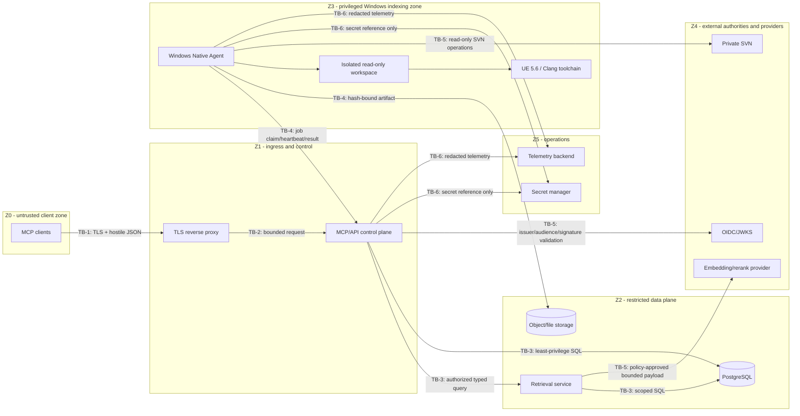

# Trust boundaries and privileged data flows

Status: implementation baseline complete; architecture and security review sign-off pending.

## Zones

| Zone | Trust level | Contents | Principal rule |
|---|---|---|---|
| Z0 client | Untrusted input | MCP clients and caller-controlled JSON | Authenticate every request; validate size, schema and rate before use. |
| Z1 ingress/control | Security enforcement point | TLS proxy and stateless MCP/API control plane | No anonymous access; authorize every project, repository, path, revision and tool. |
| Z2 data plane | Restricted service network | PostgreSQL, protected object/file storage and retrieval service | Service identities and least-privilege roles only; never client-addressable. |
| Z3 execution/indexing | Highly privileged isolated Windows zone | Windows Native Agent, SVN workspaces, UE 5.6/Clang tools | Only typed leased jobs; no user command strings; isolate workspace and OS identity. |
| Z4 external authorities/providers | Independently administered | SVN, OIDC/JWKS and approved embedding/rerank endpoint | TLS, explicit endpoint allowlist, narrow credentials and fail-closed validation. |
| Z5 operations | Administrative | Secret manager, deployment control and observability administration | Named operators, audited access, separation from user and Agent tokens. |

## Boundary controls

### TB-1: client to reverse proxy

- Internal TLS is mandatory; plaintext listeners are not a supported production mode.
- Request body, connection, concurrency and rate limits apply before JSON parsing.
- Only the Streamable HTTP MCP route and explicit health endpoints are reachable.
- Client IP is audit metadata, not identity. Forwarded headers are trusted only from the configured proxy.

### TB-2: reverse proxy to control plane

- The control plane independently validates authentication and JSON Schema; the proxy is not an authorization oracle.
- Unknown methods, duplicate/ambiguous fields, oversized strings, invalid Unicode and excess nesting are rejected consistently.
- Error shapes are bounded and avoid revealing whether an unauthorized project, path or symbol exists.

### TB-3: control plane to data plane

- Database roles are split by migration, runtime read/write, retrieval and backup duties.
- Every query carries an authorized project/repository scope and one active generation identifier.
- Effective access is the intersection of current MCP ACL and a fresh SVN ACL snapshot. Missing, stale or indeterminate state denies access.
- Object identifiers are not capabilities. The server re-authorizes IDs supplied by callers.
- Database and object storage are not routed to Z0.

### TB-4: control plane to Windows Agent

- Agent registration and job APIs use short-lived service credentials, never an MCP user token.
- Jobs use a lease, unique attempt, pinned revision set and typed payload. Replay, expired lease and mismatched Agent capability are rejected.
- The Agent accepts only implemented operations and allowlisted parameters; it never evaluates a caller-provided shell/command line.
- Workspaces are separated by project/repository/revision/job; paths are canonicalized and constrained under a configured root.
- Returned manifests and artifacts include content hashes, schema/exporter versions and size limits before publication.

### TB-5: external authorities and providers

- SVN credentials are read-only and scoped to required repositories; SVN server identity is verified.
- OIDC validation pins configured issuer and audience and requires a supported algorithm, valid time window and current keys. Key-fetch failure does not accept unverifiable tokens.
- Provider endpoints are administrator allowlisted. Redirects, link-local/private destinations outside policy and arbitrary per-request endpoints are rejected.
- Full source trees are never sent to providers. Batches are bounded, minimized, authorized for processing and excluded from application logs.

### TB-6: operations and secrets

- Configuration stores opaque secret references such as secret-manager identifiers, never secret values.
- Secrets resolve at runtime into process memory, are never returned through MCP, and are redacted from logs, traces, errors, events and artifacts.
- Token values are not stored; only memory-hard or keyed hashes and non-secret metadata are durable.
- Telemetry export failure must not cause raw payload fallback logging.

## Permanent capability boundary

MCP schemas and routing must never expose:

- source/code or arbitrary file write;
- patch generation/application as an executable server operation;
- SVN commit, Git commit/push, Perforce submit or an equivalent VCS mutation;
- a general shell, arbitrary executable, command string, environment override or unrestricted argument list.

Reindexing changes only index state. Future UBT/UAT execution, after its phase gates, selects a reviewed administrator preset ID and a pinned revision; it cannot alter version-controlled source or widen this boundary.

## Required negative tests and review checks

- Expired/revoked/wrong-audience identities and stale SVN ACL snapshots are denied.
- A principal with only SVN access or only MCP access receives no evidence, counts or existence hints.
- Encoded traversal, alternate separators, junctions/symlinks, case ambiguity and repository-relative path escape are rejected.
- A caller cannot choose a provider URL, executable, arguments, workspace root, database generation or object URI.
- An Agent cannot complete another attempt's lease or publish a revision/manifest different from the assigned job.
- Secret canaries and complete-source canaries do not occur in logs, traces, job events or error responses.
- MCP tool enumeration contains no code-write, patch, commit, push, submit, arbitrary file or general-shell capability.

Reviewers must map these controls to network policy, schema tests, ACL tests, database grants and Agent sandbox configuration before G1 sign-off.
